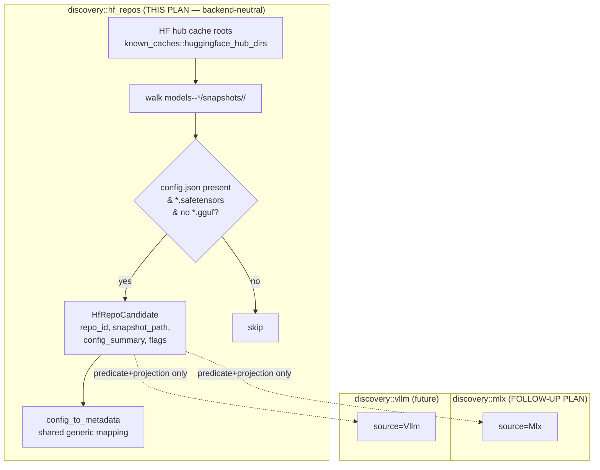
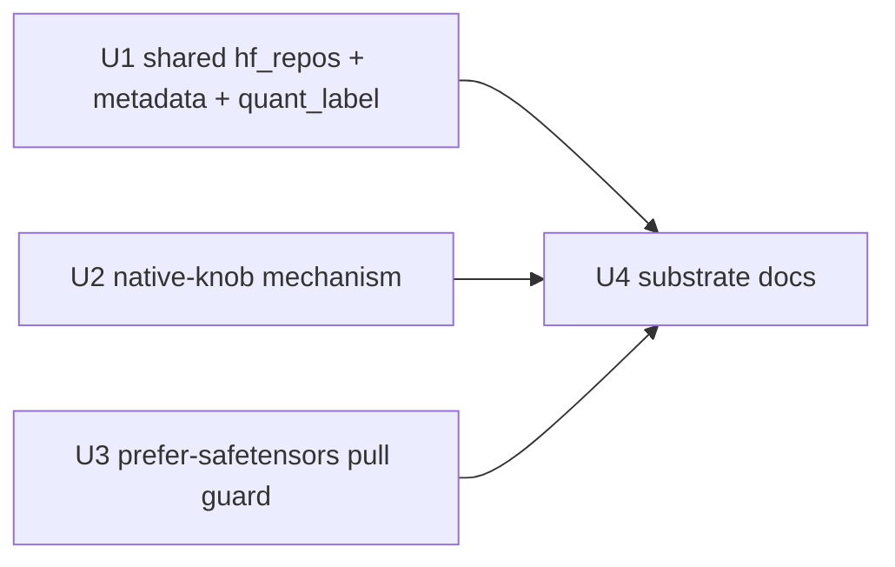

# feat: Shared safetensors/HF-repo discovery substrate (MLX/vLLM-ready)

> **Part 1 of 2.** This plan ships the backend-neutral substrate that any
> safetensors/HF-format engine (MLX, vLLM, future direct backends) plugs into.
> It is fully implementable and validatable on Linux — **zero Apple hardware,
> zero MLX symbols**. The MLX backend that consumes this substrate lands in the
> follow-up plan **[`2026-06-24-002-feat-mlx-backend-plan.md`](2026-06-24-002-feat-mlx-backend-plan.md)**,
> which needs a Mac for end-to-end validation. Both were split out of the
> original `2026-06-16-001-feat-mlx-backend-shared-discovery-plan.md`.

## Overview

The headline architectural decision of the MLX work — and the user's explicit
ask — is that **model discovery for safetensors/HF-format engines is built as a
shared substrate**, not as MLX-specific code. This plan extracts and ships that
substrate on its own, ahead of MLX, so the foundation is in place (and proven
reusable) before any Apple-hardware-gated work begins.

Three reusable pieces — each one a place the "shared-vs-backend split" pays off,
each carrying a test that proves it references no backend-specific symbols:

1. **Two-layer discovery.** A backend-agnostic HF-snapshot-repo enumerator walks
   the HF hub cache once and yields neutral `HfRepoCandidate` rows; a future
   backend supplies only a small eligibility predicate + projection. Includes
   ~90% of metadata parsing via a shared `config_to_metadata()` helper and a new
   `quant_label` field on `ModelMetadata` for non-GGML quant strings.
2. **Per-backend native-knob mechanism.** A generic, string-id-keyed channel
   (`Backend::native_knobs()` + `LaunchParams.backend_knobs`) that lets a backend
   declare tunables outside the llama.cpp `KnobField` IR, rendered as
   backend-filtered cycle/edit rows in the launch picker. Shipped against a
   test-only descriptor set (no real backend returns knobs yet) so it can't grow
   backend-shaped assumptions.
3. **Prefer-safetensors pull guard.** A small download-layer helper so a
   safetensors snapshot pull doesn't double-download duplicate PyTorch `.bin`
   weights. Generic over any safetensors repo.

Everything here is **additive**: existing GGUF / llama.cpp / Lemonade behavior
stays byte-stable, the native-knob channel is empty for every shipping backend,
and the new `quant_label` field defaults `None`. The value is realized when MLX
(and later vLLM) consume the substrate.

## Problem Frame

llamastash today serves GGUF models (llama.cpp) and a Lemonade registry. The
brainstorm (origin: `docs/brainstorms/2026-06-08-multi-backend-abstraction-requirements.md`
§"Future direct backends (MLX, FLM, vLLM)") flags that adding a second *direct*
backend right means the discovery layer must generalize so vLLM is "the easy add
the Success Criteria promise." Two structural gaps block any non-GGUF backend:

1. **Discovery assumes GGUF.** The scanner walks the HF cache for `.gguf` files.
   MLX/vLLM repos are *directories* of `config.json` + `*.safetensors` with no
   GGUF. There is no enumerator for non-GGUF model repos.
2. **Tunables are llama.cpp-keyed.** The shared `KnobField` IR maps to
   llama-server flags. A backend whose real tunables don't live in that IR has
   nowhere to surface a *relevant* knob set in the UI.

Both gaps are backend-neutral to close. Closing them here means the MLX plan (and
any future safetensors backend) is a predicate + projection + a knob table, not a
cache-walking / `config.json`-parsing / picker-plumbing rewrite.

## Requirements Trace

Plan-local requirements (from the multi-backend brainstorm + the resolved scope
decisions of the original MLX plan):

- **P1 (Shared discovery)** — Non-GGUF HF-repo discovery is a reusable substrate;
  a future backend adopts it via a predicate + projection only. **This is the
  central design requirement.** Advances brainstorm R12/R13/R14 (generalized
  identity + per-row backend tag from source) at the substrate level.
- **P4 (Relevant knobs)** — the launch UI can show only knobs relevant to the
  active backend. This needs a per-backend native-knob channel reusable by any
  backend. Advances brainstorm R4 (shared IR stays llama.cpp-keyed) + R6
  (knob-capability subset).
- **P3-substrate (Pull)** — the multi-file repo downloader prefers safetensors
  over duplicate PyTorch weights, so a snapshot pull is clean for any
  safetensors backend.

## Scope Boundaries

- **No MLX, no backend.** This plan ships no `Backends::Mlx`, no `mlx://` scheme,
  no `ModelSource::Mlx`, no `discovery::mlx`, no MLX knob descriptors, no
  `MlxConfig`. The proof of reuse is a documented seam + neutrality tests
  asserting the enumerator and native-knob mechanism reference no backend
  symbols. Consuming the substrate is the follow-up plan's job.
- **No `start_model` orchestration changes.** The launch identity-branch /
  per-backend binary-selection generalization is deliberately deferred to the
  MLX plan, where it lands with its first non-llama-server consumer (avoids a
  speculative refactor of the riskiest branch with no consumer to validate it).
- **No new `KnobField` IR fields.** The shared llama.cpp-keyed typed-knob enum is
  not extended. The native-knob channel (Unit 2) is *parallel* to the IR, not a
  growth of it.
- **No UI behavior change for shipping backends.** The native-knob picker rows
  render only for a backend that returns a non-empty `native_knobs()` — none do
  in this plan, so the picker is visually unchanged. Exercised by a test-only
  descriptor set.
- **No new config keys, no new CLI surface.** The substrate is internal until MLX
  wires user-facing config/flags in the follow-up.

## Context & Research

### Relevant Code and Patterns

- `src/discovery/known_caches.rs` + `model_caches::huggingface_hub_dirs(home)` —
  already resolves HF hub cache roots (honoring `HF_HOME` / `HF_HUB_CACHE`).
  **Reuse for the shared enumerator** so non-GGUF discovery scans the same roots
  GGUF discovery already does.
- `src/discovery/scanner.rs` + `watcher.rs` — already understand the
  `models--<owner>--<repo>/snapshots/<rev>/` layout (see `scanner.rs:431`,
  `watcher.rs:50`). The shared enumerator walks the same structure for non-GGUF
  repos, with the same best-effort resilience (one bad repo never aborts a scan).
- `src/discovery/lemonade.rs` — the **list-only discovery source** pattern
  (best-effort, never aborts the scan, projects rows with synthesized metadata).
  The future per-backend leaf mirrors this; this plan only ships the shared walk
  it sits on.
- `src/gguf/metadata.rs` — `ModelMetadata`. Gains an optional `quant_label`
  string; GGUF constructors default it `None` (no GGUF behavior change).
- `src/launch/flag_aliases.rs` — `knob_specs` / `KnobSpec` (the
  `field → label/description` static table). `NativeKnobDescriptor` mirrors its
  shape for the per-backend channel.
- `src/tui/launch_picker.rs::knob_supported` / `field_visible` — the
  **capability-driven knob filter already exists** (built for Lemonade: it shows
  only `ctx`). The native-knob channel extends this same hook; `cycle_*` + the
  `e`-edit affordance (`TensorSplit`/`Extras`) are the render patterns to mirror.
- `src/launch/params.rs` — `LaunchParams`; gains `backend_knobs:
  BTreeMap<String, KnobValue<String>>` and the native-knob resolver layering.
- `src/backend/mod.rs` — the `Backend` trait + `Backends` enum. Gains
  `native_knobs(&self) -> &'static [NativeKnobDescriptor]` (default `&[]`,
  forwarded through `Backends`); no new variant.
- `src/cli/pull.rs` → `src/init/download.rs::download_repo` — **already** a
  general multi-file downloader (`probe_repo` lists siblings via
  `repo.info().siblings`; the `(None, None)` `select_files` arm returns the whole
  repo). The only gap is a prefer-safetensors filter for mixed repos.

### Institutional Learnings

- `docs/solutions/` is empty — no prior memo applies.
- `docs/plans/2026-06-08-001-refactor-backend-trait-abstraction-plan.md` and
  `docs/plans/2026-06-10-001-feat-lemonade-backend-reintegration-plan.md` are the
  proven precedents for landing backend-seam work through the trait; the
  native-knob channel follows their neutrality discipline (build generic, prove
  it carries no backend-shaped assumptions, then let a backend consume it).

### External References

- MLX models (the substrate's first intended consumer): `mlx-community/*` HF
  repos, MLX-format `.safetensors` + `config.json` (quantized models carry a
  `quantization` block with `group_size`/`bits`). The enumerator must surface
  these repos as neutral candidates; the *eligibility* heuristic that keys on
  org / quant signature is the follow-up plan's concern, not this one. Source:
  [mlx-lm conversion & quantization](https://deepwiki.com/ml-explore/mlx-lm/2.2-model-conversion-and-quantization),
  [mlx-community on HF](https://huggingface.co/mlx-community).

## Key Technical Decisions

- **Two-layer discovery (P1).** A shared, backend-neutral `discovery::hf_repos`
  enumerator yields `HfRepoCandidate{ repo_id, snapshot_path, config_summary,
  has_safetensors, has_gguf }`. Per-backend modules (future `discovery::mlx`,
  `discovery::vllm`) will own only an `eligible(&HfRepoCandidate) -> bool`
  predicate + a `project(candidate) -> DiscoveredModel` that stamps their
  `ModelSource`. Rationale: this is the exact shape of the existing `scanner`
  (shared walk) + per-source tagging. A unit test asserts the enumerator
  references no backend-specific symbols.

- **Metadata parsing is ~90% shared (reinforces P1).** A safetensors repo has no
  GGUF header; `ModelMetadata` is synthesized from JSON. Most fields are generic
  HF-transformers: `arch` ← `config.json.model_type`, `native_ctx` ←
  `max_position_embeddings`, `chat_template` ← **`tokenizer_config.json`** (a
  *second* file the enumerator reads), `tokenizer_kind` ← `tokenizer_class`,
  `mode_hint` ← architectures, `total_parameters`/`parameter_label` ← config-dim
  estimate or repo-name label. A shared `config_to_metadata()` helper does this
  mapping; future backends reuse it verbatim. Only quant interpretation is
  backend-specific (left to the leaf).

- **Quant representation: add `quant_label: Option<String>` to `ModelMetadata`.**
  `Quant` is GGML-only and `#[derive(Copy)]`; non-GGML affine quant ("4-bit
  gs64") has no variant, and `Unknown(u32)` means "unknown *GGML* tag" — wrong to
  reuse. Adding `Quant::Other(String)` would break `Copy` (ripples widely). So
  add an optional `quant_label` string (rendered verbatim where present; `quant`
  stays `Unknown(0)` for non-GGUF). The field is `Option`, so GGUF constructors
  default it `None` — no GGUF behavior change. MLX/vLLM populate it in their leaf.

- **Param count: estimate, don't parse safetensors headers.** Quantized tensors
  are packed (uint32 + group scales), so summing tensor shapes mis-counts. The
  shared helper uses a config-dim estimate (quant-independent) or the repo-name
  label for display; exact count deferred.

- **Per-backend native knobs (P4) — the "relevant knobs" mechanism.** A backend's
  real tunables may live *outside* the llama.cpp IR, so add a parallel,
  string-id-keyed channel: `Backend::native_knobs() -> &'static
  [NativeKnobDescriptor]` (default empty; llama.cpp/Lemonade return none). A
  descriptor carries `id`/`label`/`description`/`kind` (`Cycle{presets}` |
  `FreeText` | `Bool`); values live in `LaunchParams.backend_knobs:
  BTreeMap<String, KnobValue<String>>`; each backend translates its own ids →
  flags in `prepare_launch`. Rationale: keeps the shared IR llama.cpp-keyed
  (brainstorm R4) while letting the UI render a curated, *relevant* knob set per
  backend; the existing picker filter
  (`launch_picker.rs::knob_supported`/`field_visible`) extends to it. `native_knobs()`
  and `capabilities()` are **orthogonal** — a backend can have
  `capabilities()==none()` and a non-empty `native_knobs()`.

- **Native-knob security strip is part of the mechanism.** The free-text
  native-knob path must refuse the same loopback/credential-bypass prefixes
  `compose` strips (`--host`/`--port`/`--api-key`/etc.), so no backend's
  free-text value can rebind off loopback. The strip helper
  (`FORBIDDEN_ADVANCED_PREFIXES`) is wired into the shared translation entry point
  here, even though no shipping backend exercises it yet.

- **Prefer-safetensors pull guard (P3-substrate).** `download_repo` already pulls
  a full snapshot for `pull <owner/repo>`. The one generality gap: a mixed repo
  shipping both `*.safetensors` and PyTorch `*.bin`/`*.pth` would double-download.
  Add a `select_files`-adjacent filter: if any `.safetensors` exist, drop the
  `.bin`/`.pth` weight duplicates (keep configs/tokenizers). Generic over any
  safetensors repo; the GGUF and `<owner/repo>:file.gguf` paths stay byte-stable.

## Open Questions

### Resolved During Planning

- *Should discovery be backend-specific or shared?* → Shared two-layer substrate
  (the central decision; P1).
- *Grow the `KnobField` IR for non-llama.cpp tunables, or a parallel channel?* →
  Parallel string-id channel (P4); the IR stays llama.cpp-keyed.
- *Ship the native-knob mechanism here with no real consumer?* → Yes, against a
  test-only descriptor set, so the channel is proven generic before MLX wires the
  first real set (the same neutrality discipline the backend seam used for
  Lemonade). It is additive and invisible to users until a backend returns knobs.

### Deferred to Implementation

- **Native-knob resolver layering depth.** Whether native knobs get the full
  preset > last-used > default layering or a simpler user-set-or-default in MVP.
- **Exact param count.** MVP uses a config-dim estimate / repo-name label; an
  exact count (de-packing quantized safetensors tensors) is deferred.
- **`config.json` weight sizing.** The leaf (follow-up) sums `*.safetensors` file
  sizes (fs metadata, no parse) for the SIZE column; the shared candidate carries
  `snapshot_path` so the leaf can do this without re-walking.

*(Resolved during research, no longer open: `hf-hub` 0.5 already exposes repo
file-listing via `repo.info().siblings` — see `src/init/download.rs::probe_repo`
— so snapshot enumeration needs no HF-HTTP-API fallback.)*

## High-Level Technical Design

> *Directional guidance for review, not implementation specification.*

**Two-layer discovery (the P1 centerpiece) — shared substrate ships here; the
per-backend leaves arrive in the follow-up plan:**

**Native-knob channel — generic mechanism ships here; backend knob sets arrive
with each backend:**

```mermaid
flowchart LR
  K[Backend::native_knobs\ndefault &#91;&#93;] --> P[picker renders\ncycle/edit rows]
  P --> V[LaunchParams.backend_knobs\nBTreeMap&lt;id, KnobValue&gt;]
  V --> T[backend.prepare_launch\ntranslates id → flag\n+ forbidden-prefix strip]
  V --> S[preset / last-params\nadditive backend_knobs object]
```

## Implementation Units

**Dependency graph:**

U1, U2, and U3 are mutually independent and can land in parallel; U4 (docs)
follows.

---

- [x] **Unit 1: Shared HF-snapshot-repo enumerator + `HfRepoCandidate` + `config_to_metadata` + `quant_label`**

**Goal:** A backend-neutral enumerator that walks the HF hub cache and yields
`HfRepoCandidate` rows for non-GGUF model repos, plus a shared
config→`ModelMetadata` mapping and the optional `quant_label` field. The reusable
substrate that makes a future safetensors backend cheap (P1) — including ~90% of
metadata parsing.

**Requirements:** P1

**Dependencies:** None.

**Files:**
- Create: `src/discovery/hf_repos.rs`
- Modify: `src/discovery/mod.rs` (register module; no `ModelSource` change)
- Modify: `src/gguf/metadata.rs` (add `quant_label: Option<String>` to
  `ModelMetadata`; default `None` in GGUF constructors — no GGUF behavior change)
- Test: inline `#[cfg(test)] mod tests` in `src/discovery/hf_repos.rs`

**Approach:**
- Resolve cache roots via the existing
  `known_caches`/`model_caches::huggingface_hub_dirs` so future backends scan the
  same roots GGUF discovery does.
- For each `models--<org>--<repo>/snapshots/<rev>/`, classify: has `config.json`,
  has `*.safetensors`, has `*.gguf`. Emit a candidate only for safetensors-
  present, gguf-absent repos.
- Parse **two** JSON files into a `config_summary`: `config.json`
  (`model_type`/`architectures`, `max_position_embeddings`, `hidden_size` /
  `num_hidden_layers` / `vocab_size` / `intermediate_size` for the param
  estimate, optional `quantization` block) and `tokenizer_config.json`
  (`chat_template`, `tokenizer_class`). Both reads are best-effort — a missing or
  unparseable file leaves that slice `None`, never drops the candidate.
- Provide a shared `config_to_metadata(&config_summary, repo_id) ->
  ModelMetadata` that fills the generic fields (arch, native_ctx, chat_template,
  tokenizer_kind, mode_hint, total_parameters/parameter_label via config-dim
  estimate or repo-name label, reasoning_hint). It leaves `quant` = `Unknown(0)`
  and `quant_label` = `None`; backends overlay quant in their projection. Future
  backends reuse this helper unchanged.
- Derive `repo_id` from the cache dir name (`models--mlx-community--Foo` →
  `mlx-community/Foo`); keep `snapshot_path` for sizing/launch resolution.
- **No backend symbols.** The module must not reference any backend — a test
  asserts neutrality.

**Patterns to follow:**
- `src/discovery/scanner.rs` (cache-root walking, `snapshots/<rev>/` layout,
  best-effort resilience — never abort the scan on one bad repo).
- `src/discovery/known_caches.rs` (root resolution, env overrides).

**Test scenarios:**
- Happy path: a fixture cache tree with one safetensors repo → one candidate with
  correct `repo_id`, `snapshot_path`, `has_safetensors=true`, `has_gguf=false`.
- Edge case: a GGUF-only repo dir → no candidate (GGUF stays the scanner's job).
- Edge case: a repo with both `.gguf` and `.safetensors` → skipped by the
  enumerator (GGUF path owns it); documented as intentional.
- Error path: `config.json` missing or unparseable → candidate still emitted with
  `config_summary=None` (don't drop the row), no panic.
- Edge case: empty/missing cache root → empty vec, no error.
- Metadata happy path: `config_to_metadata` on a fixture `config.json`
  (`model_type:"qwen2"`, `max_position_embeddings:32768`) +
  `tokenizer_config.json` (`chat_template:"..."`) → `arch=="qwen2"`,
  `native_ctx==Some(32768)`, `chat_template==Some(...)`, `mode_hint==Chat`.
- Metadata edge: `tokenizer_config.json` absent → `chat_template==None`, other
  fields still populated from `config.json` (the two-file read degrades per file).
- Metadata edge: param estimate from config dims yields a `parameter_label` in a
  familiar bucket (e.g. `~3B`); helper leaves `quant`/`quant_label` unset.
- Neutrality: a test (or `grep`-style assertion) that `hf_repos` imports no
  backend module symbols.
- Quant field: a GGUF model's `ModelMetadata` round-trips with `quant_label==None`
  and its JSON shape is byte-stable.

**Verification:** Enumerator returns correct candidates against a temp HF-cache
fixture; GGUF repos are excluded; broken `config.json`/`tokenizer_config.json`
degrade gracefully; `config_to_metadata` fills generic fields; module is
backend-neutral; `quant_label` adds without changing GGUF output.

---

- [x] **Unit 2: Per-backend native-knob mechanism (generic, stub-tested)**

**Goal:** A generic channel for a backend to declare its own knobs (beyond the
llama.cpp `KnobField` IR), rendered as backend-filtered cycling/edit rows in the
launch picker and persisted in presets/last-params. This is what will make "show
only relevant knobs for a backend" real (P4). Shipped against a test-only
descriptor set so it carries no backend-shaped assumptions; the first real knob
set (MLX) arrives in the follow-up plan.

**Requirements:** P4, R4, R6

**Dependencies:** None (parallel with U1).

**Files:**
- Create: `src/launch/native_knobs.rs` — `NativeKnobKind` (`Cycle{presets}` |
  `FreeText` | `Bool`), `NativeKnobDescriptor { id, label, description, kind }`,
  and the id→flag translation entry point with the forbidden-prefix strip.
- Modify: `src/backend/mod.rs` — `Backend::native_knobs(&self) -> &'static
  [NativeKnobDescriptor]` (default `&[]`; forward through `Backends`; llama.cpp /
  Lemonade inherit the empty default).
- Modify: `src/launch/params.rs` — `LaunchParams.backend_knobs:
  BTreeMap<String, KnobValue<String>>`; resolver layering for native knobs.
- Modify: persistence — preset + last-params store/restore a `backend_knobs`
  object (additive key) in `state.json` and the preset/last-params JSON shapes.
- Modify: `src/tui/launch_picker.rs` — `PickerField::NativeKnob(String)`; render
  descriptors below the capability-filtered typed knobs for *whatever* backend the
  selection resolves to; `←/→` cycle for `Cycle`/`Bool`, `e`-edit for `FreeText`;
  extend the existing `knob_supported`/`field_visible` hook to call
  `backend.native_knobs()` generically (no backend-specific arm — none exist yet).
- Test: inline tests across the above + picker render/cycle/edit + persistence
  round-trip, all driven by a **test-only descriptor slice** (one `Cycle` + one
  `FreeText` + one `Bool`).

**Approach:**
- The shared `KnobField` IR stays llama.cpp-keyed (R4); native knobs are a
  parallel, string-id channel. `capabilities()` and `native_knobs()` are
  orthogonal.
- Translation reuses the forbidden-prefix strip so a free-text value can't smuggle
  `--host`/`--port`. The strip helper is wired here even though no shipping
  backend exercises it.
- Resolver: native knobs layer preset > last-used > descriptor default (may
  collapse to user-set-or-default in MVP — see deferred).
- Render through a descriptor slice, not a backend enum variant, so the mechanism
  is testable without a real backend that returns knobs.

**Execution note:** Build and test the entire mechanism against the test-only
descriptor slice — this is the neutrality proof. Do **not** add any backend's knob
set here; that is the follow-up plan's first consumer.

**Patterns to follow:**
- `src/launch/flag_aliases.rs` (`knob_specs` static-table shape) for the
  descriptor table.
- `src/tui/launch_picker.rs` (`cycle_*`, `field_visible`, `knob_supported`, the
  `e`-edit affordance used by `TensorSplit`/`Extras`).

**Test scenarios:**
- Happy path: a stub descriptor slice with one `Cycle` + one `FreeText` → picker
  renders both; cycling/editing updates `LaunchParams.backend_knobs`.
- Translation: `backend_knobs{foo:Set("8"), bar:Set("./x")}` through the shared
  translation entry point with a stub id→flag map → `--foo 8 --bar ./x`.
- Security: a native-knob value `--host 0.0.0.0` is stripped by the translation
  entry point.
- Filter: a backend that returns `&[]` (llama.cpp / Lemonade) shows no native rows
  — picker behavior byte-identical to today.
- Persistence: a preset carrying `backend_knobs` round-trips through `state.json`;
  a preset with no native knobs stays byte-stable.
- Resolver: a saved native-knob value is reapplied next launch unless overridden.
- Edge: an unset / `Auto` native knob emits no flag.

**Verification:** The picker renders curated knob rows for any backend that
returns descriptors and none for backends that don't; values translate to flags,
persist, and survive the security strip; llama.cpp / Lemonade picker + persistence
behavior is byte-identical (no backend returns knobs in this plan).

---

- [x] **Unit 3: Prefer-safetensors pull guard**

**Goal:** Make the existing multi-file repo downloader clean for safetensors
snapshots: when a repo ships both `*.safetensors` and PyTorch `*.bin`/`*.pth`,
don't double-download the duplicate weights. Generic over any safetensors repo —
the download-layer half of the original MLX pull unit.

**Requirements:** P3-substrate

**Dependencies:** None (parallel with U1/U2).

**Note on scope (verified against `src/init/download.rs`):** `download_repo` is
already a general multi-file downloader — `probe_repo` lists siblings via
`repo.info().siblings`, `select_files`'s `(None, None)` arm returns the whole
repo, and standalone `pull owner/repo` already runs with `extension_filter:
None`. So `pull owner/repo` already pulls the full snapshot today. The remaining
work is the dedup guard only; the TUI dialog path for non-GGUF repos lands in the
follow-up plan (it's user-facing and only meaningful once a safetensors backend
can launch).

**Files:**
- Modify: `src/init/download.rs` — a `select_files`-adjacent prefer-safetensors
  filter: given the sibling list, if any `.safetensors` exist, exclude `.bin`/
  `.pth` weight duplicates (keep configs/tokenizers).
- Modify: `src/cli/cli_args.rs` only if a `pull --safetensors`/`--all` hint is
  wanted to force whole-repo on a mixed repo (optional; default already pulls all
  — lean toward not adding a flag unless code-time review shows a need).
- Test: extend `src/init/download.rs` tests for the prefer-safetensors filter.

**Approach:**
- Reuse the existing whole-repo download path verbatim — no new download engine,
  just the dedup filter applied to the sibling set before selection.

**Test scenarios:**
- Prefer-safetensors: a repo with both `model.safetensors` and
  `pytorch_model.bin` → the filtered set keeps the safetensors, drops the `.bin`;
  configs/tokenizers retained.
- Edge case: a safetensors-only repo with no `.bin` → filter is a no-op.
- Regression: `pull owner/repo:file.gguf` and GGUF whole-repo pull unchanged
  (existing download tests stay green).

**Verification:** Mixed safetensors+PyTorch repos don't double-download; GGUF pull
is unchanged; the filter is a no-op where there's nothing to dedup.

---

- [ ] **Unit 4: Substrate docs + TODO**

**Goal:** Document the shared substrate (the repo's "docs ship with code" rule)
and record deferred follow-ups, without yet describing MLX (that's the follow-up
plan's doc sweep).

**Requirements:** P1, P4 (documentation of)

**Dependencies:** U1, U2, U3.

**Files:**
- Modify: `docs/architecture.md` — note the shared two-layer discovery substrate
  (`discovery::hf_repos` + `config_to_metadata`) and the per-backend native-knob
  channel as extension seams; no third backend claimed yet.
- Modify: `CLAUDE.md`/`AGENTS.md` scope boundaries — a short note that non-GGUF
  HF-repo discovery + the native-knob channel exist as backend-neutral seams (the
  full "Config presets"-style scope bullet for MLX lands in the follow-up).
- Modify: `CHANGELOG.md` — these are largely internal/foundation changes; per the
  repo rule, internal-only refactors can be omitted. Add a single `[Unreleased]`
  line only if any of it is user-observable (the `quant_label` JSON field is the
  one candidate — keep it terse or fold into the MLX entry later).
- Modify: `TODO.md` — link the two split plans on the R5 MLX line; record deferred
  substrate items (native-knob resolver-layering depth, exact param count,
  config-dim estimate refinement) with source links.
- Modify: this plan's checkboxes (tick units as they land).

**Test scenarios:** none — documentation + tracking only.

**Verification:** A reader of `docs/architecture.md` understands the shared
discovery + native-knob seams; `TODO.md` links both plans and lists deferred
substrate items; no doc statement contradicts shipped behavior.

## System-Wide Impact

- **Interaction graph:** Adds a discovery enumerator module (consumed by the
  rescan loop only once a backend leaf exists — no rescan wiring here), a
  native-knob mechanism (consumed by the picker + persistence + `prepare_launch`,
  empty for all shipping backends), and a download-layer filter. The supervisor,
  proxy, eviction, and resource sampler are untouched.
- **State lifecycle risks:** Presets / last-params gain a `backend_knobs` object —
  an *additive* key; pre-release, so no back-compat shim, but rows without it must
  stay byte-stable (pinned by tests). `quant_label` adds to `ModelMetadata` as an
  `Option` defaulted `None`.
- **API surface parity:** `list`/`status` JSON gain a `quant_label` field
  additively (always `null` until a backend sets it); preset/last-params JSON gain
  `backend_knobs` (always empty until a backend declares knobs). All existing
  row/field shapes stay byte-stable.
- **Unchanged invariants:** GGUF discovery, llama.cpp argv (golden parity),
  Lemonade behavior, the proxy route table, the IPC `status` shape, and the
  picker's rendered rows for shipping backends all remain as-is.
- **Neutrality is the deliverable:** the enumerator's no-backend-symbols test and
  the native-knob mechanism's stub-only test are what prove the substrate is ready
  for MLX/vLLM to consume without rework.

## Risks & Dependencies

| Risk | Mitigation |
|------|------------|
| Native-knob channel churns the picker + preset/last-params persistence | Build generic against a test-only descriptor slice; native knobs are additive (empty for every shipping backend, so their picker + persistence are untouched); preset byte-stability pinned by tests. |
| `quant_label` field added to `ModelMetadata` ripples into GGUF constructors | New field is `Option`, defaulted `None`; GGUF rendering/JSON unchanged when absent — covered by existing output byte-stability tests. |
| Shipping a generic mechanism with no real consumer reads as dead code | Each unit carries standalone test value (neutrality test, stub-descriptor test, dedup test); the consumer (MLX) lands in the immediate follow-up plan, so the gap is short and intentional. |
| Substrate shape doesn't fit the eventual MLX/vLLM leaf | The enumerator + `config_to_metadata` mirror the existing `scanner` + per-source projection split that Lemonade already validated; the follow-up plan's leaf is a predicate + projection only. |

## Documentation / Operational Notes

- Docs ship with code (repo rule): U4 lands the architecture-diagram seam note
  and the deferred-work ledger. The full MLX setup guide / README positioning is
  the follow-up plan's sweep.
- Operational: no new network listener, no new config key, no new CLI surface, no
  new privileged surface. Everything here is internal substrate.

## Phased Delivery

### Single phase — shared substrate (U1, U2, U3, U4)
All three substrate pieces are independent and small; land them in parallel, then
the docs sweep. The exit criterion is: the enumerator + metadata helper + quant
field, the native-knob mechanism, and the prefer-safetensors guard all ship green
on Linux with zero MLX symbols, proven by the neutrality/stub tests — leaving the
follow-up plan a pure predicate-projection-knobs-and-wiring job.

## Sources & References

- **Origin document:** [docs/brainstorms/2026-06-08-multi-backend-abstraction-requirements.md](docs/brainstorms/2026-06-08-multi-backend-abstraction-requirements.md) (§"Future direct backends (MLX, FLM, vLLM)")
- **Consumer plan:** [docs/plans/2026-06-24-002-feat-mlx-backend-plan.md](2026-06-24-002-feat-mlx-backend-plan.md) (the MLX backend that consumes this substrate; needs Apple hardware)
- Backend seam precedent: `docs/plans/2026-06-08-001-refactor-backend-trait-abstraction-plan.md`, `docs/plans/2026-06-10-001-feat-lemonade-backend-reintegration-plan.md`
- Code: `src/discovery/mod.rs`, `src/discovery/scanner.rs`, `src/discovery/known_caches.rs`, `src/discovery/lemonade.rs`, `src/gguf/metadata.rs`, `src/launch/flag_aliases.rs`, `src/launch/params.rs`, `src/tui/launch_picker.rs`, `src/init/download.rs`
- External: [mlx-lm conversion & quantization](https://deepwiki.com/ml-explore/mlx-lm/2.2-model-conversion-and-quantization), [mlx-community on HF](https://huggingface.co/mlx-community)
