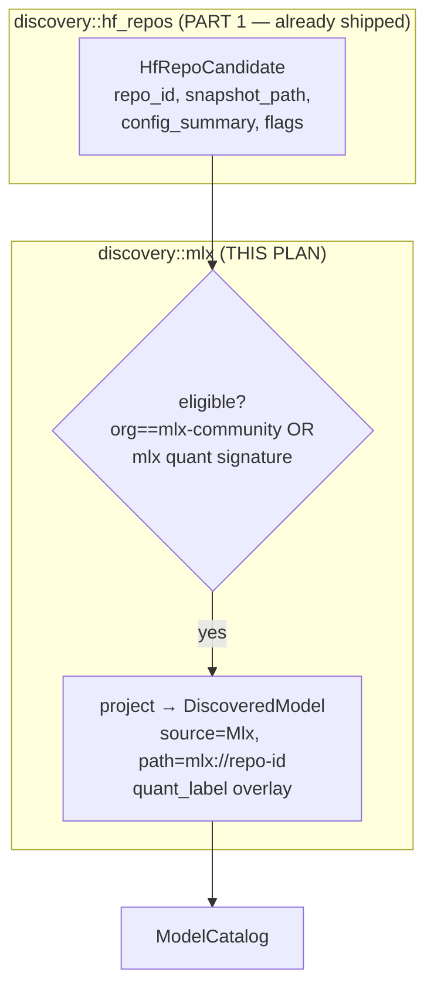
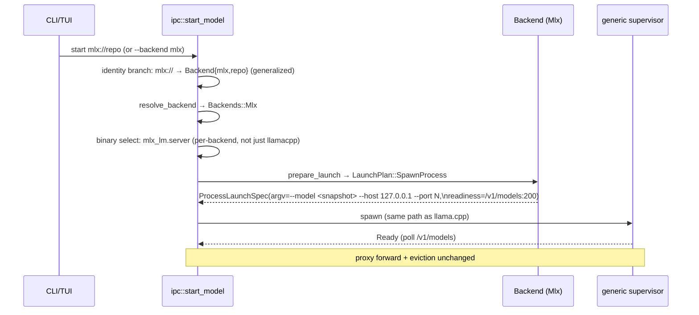
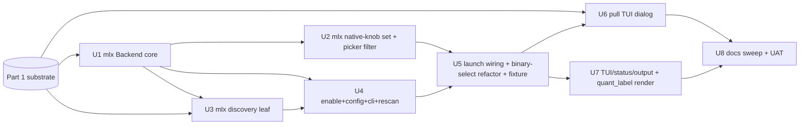

# feat: MLX backend on the shared discovery substrate (Apple Silicon)

> **Part 2 of 2.** This plan adds MLX (`mlx_lm.server`, Apple Silicon) as a third
> inference backend, consuming the backend-neutral substrate shipped in
> **[`2026-06-24-001-feat-shared-safetensors-discovery-substrate-plan.md`](2026-06-24-001-feat-shared-safetensors-discovery-substrate-plan.md)**
> (the shared HF-repo enumerator, `config_to_metadata`, the `quant_label` field,
> the native-knob mechanism, and the prefer-safetensors pull guard). **Land Part 1
> first.** This part is MLX-specific and needs a **Mac** for end-to-end validation
> (readiness timing on the real binary, `[Cpu, Metal]` surfacing, the UAT loop).
> Both parts were split out of the original
> `2026-06-16-001-feat-mlx-backend-shared-discovery-plan.md`.

## Overview

Add MLX (`mlx_lm.server`, Apple Silicon) as a third inference backend behind the
existing `Backend` seam, alongside llama.cpp (direct, process-per-model) and
Lemonade (managed-multiplexer). MLX is the brainstorm's canonical "clean direct
peer": same process-per-model lifecycle as llama.cpp, so it rides the generic
supervisor unchanged and the format-agnostic proxy forward unchanged.

This plan assumes Part 1 has landed, so the heavy lifting (cache walking,
`config.json`/`tokenizer_config.json` parsing, the native-knob channel, the
prefer-safetensors download filter) already exists as backend-neutral substrate.
What remains is MLX-specific:

- the `MlxBackend` trait impl + `mlx://` scheme + identity + dispatch wiring;
- the MLX native-knob set (the first real consumer of the Part-1 channel) +
  picker filtering for an MLX selection;
- the MLX discovery *leaf* (eligibility predicate + projection over Part-1's
  `HfRepoCandidate`);
- enable/config/CLI surface (`mlx.enabled` default-on, `--backend mlx`,
  `--mlx`/`--no-mlx`) + rescan wiring;
- the `start_model` orchestration generalization (identity branch + per-backend
  binary selection + snapshot resolution) + the `fake_mlx_server` fixture;
- the MLX pull TUI dialog path;
- TUI badges + status/CLI output;
- the MLX setup guide, README positioning, and the Mac UAT.

Per the resolved scope decisions: the MVP ships MLX **enabled by default**
(`mlx.enabled: true`), active wherever `mlx_lm.server` is detected, and **extends
`llamastash pull`** to fetch full MLX snapshot repos (the Part-1 guard plus a TUI
dialog path).

## Problem Frame

With Part 1 landed, llamastash can *enumerate* non-GGUF HF repos as neutral
candidates and *render* per-backend native knobs, but ships no backend that
consumes either. Apple Silicon users running MLX-format models (the
`mlx-community` ecosystem) still have no way to discover or launch them, even
though `mlx_lm.server` is a clean OpenAI-compatible subprocess that fits the
existing seam. The brainstorm (origin:
`docs/brainstorms/2026-06-08-multi-backend-abstraction-requirements.md`
§"Future direct backends (MLX, FLM, vLLM)") names MLX as the proof that the trait
holds for a second *direct* backend.

One structural change remains beyond writing the MLX leaf: **the launch
orchestrator's binary + identity branches are bi-modal.** They special-case
"GGUF → llama-server" vs "Lemonade synthetic path → umbrella". A third shape
(process-per-model, non-GGUF, its own binary `mlx_lm.server`) needs both branches
generalized — this is the riskiest edit and lands here, with MLX as its first
non-llama-server consumer.

## Requirements Trace

Origin requirements (multi-backend brainstorm) this plan advances:

- **R2** — Two lifecycle shapes. MLX is shape 1 (process-per-model); proves the
  trait holds for a second direct backend.
- **R3** — Closed dispatch enum. Add `Backends::Mlx` + every match arm.
- **R6** — Knob-capability subset. MLX honors ~no llama.cpp knobs
  (`capabilities()==none()`); the shared-IR rows are filtered out of the UI, and
  MLX's real tunables come via the Part-1 native-knob channel.
- **R12** — Generalized identity. MLX uses `ModelIdentity::Backend{backend:"mlx",
  name:<repo-id>}`.
- **R13/R14** — Identity→backend selection + per-row backend tag from source.
- **R16** — Accelerator support. MLX declares `[Cpu, Metal]`.
- **R17** — Per-model backend override. `start --backend mlx`.

Plan-local requirements (resolved scope decisions + user ask), consuming Part 1:

- **P2 (Enabled by default)** — `mlx.enabled` defaults to `true`; MLX is active
  wherever `mlx_lm.server` is detected. `mlx.enabled: false` (or `--no-mlx`) turns
  it off; binary absence is a silent no-op.
- **P3 (Pull)** — `llamastash pull <owner/repo>` fetches a full MLX snapshot; the
  Part-1 prefer-safetensors guard prevents double-download, and this plan adds the
  TUI `d` dialog path.
- **P1-leaf** — the MLX discovery leaf (predicate + projection) over Part-1's
  shared enumerator; MLX native knobs over Part-1's channel; the proof Part 1's
  split was worth it.

## Scope Boundaries

- **Not vLLM.** This plan ships no vLLM backend, predicate, or `ModelSource::Vllm`.
  Part 1 already proved the substrate is backend-neutral; vLLM is a separate
  future plan.
- **Not a new proxy path.** MLX is process-per-model with a real port; the
  existing format-agnostic proxy forward routes it unchanged. No `proxy::route`
  changes (unlike Lemonade's umbrella routing).
- **No on-the-fly conversion.** llamastash never runs `mlx_lm.convert`. Discovery
  surfaces already-MLX-format repos; pull downloads pre-converted repos.
- **No MLX-specific admission/OOM projection in MVP.** GGUF admission
  (`project_demand`) is GGUF-header-specific. MLX launches skip it (like Lemonade
  today); a config.json-param-count projection is a deferred follow-up in
  `TODO.md`.
- **No new `KnobField` IR fields.** MLX's tunables surface through the Part-1
  native-knob channel, not by growing the shared IR. Truly one-off flags still
  ride `extras`.

## Context & Research

### Relevant Code and Patterns

- **From Part 1 (already shipped):** `src/discovery/hf_repos.rs`
  (`HfRepoCandidate`, `config_to_metadata`), `ModelMetadata.quant_label`,
  `src/launch/native_knobs.rs` (`NativeKnobDescriptor`, the id→flag translation +
  strip), `LaunchParams.backend_knobs`, the picker's generic native-knob
  rendering, and the prefer-safetensors filter in `src/init/download.rs`. This
  plan **consumes** these; it does not re-implement them.
- `src/backend/mod.rs` — the seam: `Backend` trait, `Backends` enum (+ every
  match arm), `BackendChoice`, `resolve_backend` / `backend_for_identity`. Adding
  a backend = new impl + enum variant + two selection arms. **Mirror this
  exactly.**
- `src/backend/llama_cpp.rs` — the **direct backend reference** to mirror:
  `ProcessPerModel`, `process_spec` builds a `ProcessLaunchSpec` (binary, argv,
  env_remove, `Readiness::HttpPoll`, probe). MLX differs only in argv construction
  (own builder, not `compose`) and readiness path.
- `src/backend/lemonade/backend.rs` — the pattern for a **non-GGUF identity +
  synthetic path scheme**: `LEMONADE_PATH_SCHEME` (`lemonade://`),
  `registry_name_from_path`, `identify` → `ModelIdentity::Backend`,
  `resolve_lemond_binary` (config path → PATH lookup). MLX reuses this exact shape
  with an `mlx://` scheme and `resolve_mlx_binary`.
- `src/backend/identity.rs` — `ModelIdentity::Backend(BackendModelId{backend,name})`,
  serde-untagged so it persists in `state.json` with no migration. MLX reuses it
  verbatim (no identity changes needed).
- `src/discovery/mod.rs` — `DiscoveredModel`, `ModelSource` enum + `label()` +
  `backend_id()`. Add `ModelSource::Mlx`.
- `src/discovery/lemonade.rs` — the **list-only discovery source** projection
  pattern. The MLX leaf mirrors `row_for`/`enumerate` but projects over Part-1's
  `HfRepoCandidate` instead of an umbrella API.
- `src/daemon/discovery_task.rs::full_rescan` — aggregates `scanner::scan` + the
  Ollama/Lemonade enumerators into the catalog each rescan. MLX enumeration hooks
  in here, gated by the resolved-enabled flag.
- `src/ipc/methods.rs` — `start_model`: identity branch (`~1449-1471`,
  special-cases the `lemonade://` synthetic path), backend resolve (`~1745`),
  binary+port selection (`~1753-1769`, currently keyed on `lifecycle ==
  ManagedMultiplexer`), `LaunchPlan` execution branch (`~1772`), GGUF-only
  admission gate (`~1807`). These are the generalization sites.
- `src/config/loader.rs` — `LemonadeConfig { enabled, binary, port }`, opt-in
  default-off, OR-ed enable via flag/env. MLX gets an analogous `MlxConfig {
  enabled, binary }` but **default-on**.
- `src/cli/cli_args.rs` — `BackendArg` enum (`Llamacpp`, `Lemonade`) + wire
  labels; `--backend` override; daemon `--lemonade` flag. Add `Mlx`.
- `src/tui/launch_picker.rs` — Part 1 added generic native-knob rendering; this
  plan adds the `BackendChoice::Mlx` filter arm (hide llama.cpp typed rows, show
  MLX native rows) and the MLX pull-dialog branch.
- `src/cli/output.rs::backend_for_source` + `src/discovery/catalog.rs` (`backend`
  field = `source.backend_id()`) — byte-stable JSON shapes; MLX rows *add* without
  changing existing rows. The `quant_label` rendering (prefer it in the quant
  column when `Some`) also lands here.
- `src/init/download.rs::download_repo` → `src/cli/pull.rs` — Part 1's
  prefer-safetensors guard plus the existing whole-repo path mean `pull
  mlx-community/Foo` already works; this plan adds the TUI dialog path (U6).
- `tests/fixtures/fake_llama_server.rs` — answers `/health`, `/v1/models`,
  `/v1/chat/completions`. The MLX fixture mirrors it minus `/health` (MLX has no
  health endpoint; readiness is `/v1/models`).

### Institutional Learnings

- `docs/plans/2026-06-08-001-refactor-backend-trait-abstraction-plan.md` and
  `docs/plans/2026-06-10-001-feat-lemonade-backend-reintegration-plan.md` are the
  proven precedents for landing a backend through the seam; this plan follows
  their unit shape.

### External References

- `mlx_lm.server` CLI: `mlx_lm.server --model <hf-repo-or-local-path> --host <h>
  --port 
`; default port 8080; OpenAI-compatible `/v1/chat/completions`,
  `/v1/completions`, `/v1/models`. **No `/health` endpoint** — readiness must poll
  `/v1/models` (200). The process loads the model at startup before accepting
  connections, so a 200 from `/v1/models` is a sound readiness signal (to be
  confirmed at execution; see deferred). Source:
  [mlx-lm SERVER.md](https://github.com/ml-explore/mlx-lm/blob/main/mlx_lm/SERVER.md).
- MLX models: `mlx-community/*` HF repos, MLX-format `.safetensors` +
  `config.json` (quantized models carry a `quantization` block with
  `group_size`/`bits`). Detection of "is this repo MLX-runnable" keys on org
  `mlx-community` and/or the MLX quantization signature — see Key Decisions.
  Source: [mlx-lm conversion & quantization](https://deepwiki.com/ml-explore/mlx-lm/2.2-model-conversion-and-quantization),
  [mlx-community on HF](https://huggingface.co/mlx-community).

## Key Technical Decisions

- **MLX is `ProcessPerModel`, not a multiplexer.** One `mlx_lm.server` per model,
  killed on eviction like llama.cpp. Resource attribution (RSS/CPU, Apple
  unified-memory VRAM) works per-PID through the existing sampler — strictly
  better than Lemonade's umbrella attribution. The proxy forward is unchanged.

- **MLX identity = HF repo id via an `mlx://` synthetic path.** Catalog key /
  launch input is `mlx://<repo-id>` (mirrors `lemonade://`); identity is
  `ModelIdentity::Backend{backend:"mlx", name:<repo-id>}`. Repo id is stable,
  machine-portable, and what `mlx_lm.server --model` accepts; reuses the
  untagged-serde `Backend` identity with zero `state.json` change.

- **Launch passes a resolved local snapshot path, offline-safe.** At launch the
  orchestrator resolves `mlx://<repo-id>` → the cached snapshot dir and passes
  that local path to `--model` (falling back to the bare repo id if unresolved).
  Avoids a network revision check on every start. The repo-id↔snapshot resolver
  can reuse `hf-hub`'s `Cache` API; exact placement is a deferred impl detail.

- **MLX eligibility heuristic (high precision over recall).** A candidate is
  MLX-eligible when org == `mlx-community` **or** `config.json` carries an MLX
  quantization signature (`quantization.group_size` + `quantization.bits`).
  Avoids surfacing every generic transformers repo as "MLX-runnable". A vanilla
  unquantized MLX repo from a non-`mlx-community` org may be missed — accepted for
  MVP; widening the predicate is a deferred follow-up.

- **Enabled-by-default config (P2).** `MlxConfig.enabled: bool`, default `true`
  (unlike Lemonade's default-off). MLX is *operative* when `enabled &&
  resolve_mlx_binary().is_some()` — on by default, with binary detection as the
  practical gate (no `mlx_lm.server` ⇒ MLX silently does nothing, so a
  Linux/Windows box without mlx-lm sees no change). Users who have mlx-lm installed
  but don't want MLX set `mlx.enabled: false` (or pass `--no-mlx`). A default-true
  bool is simpler than a tri-state and matches the requested config shape.

- **MLX maps to ~zero of the shared IR → `capabilities()` = `none()`.** Walking
  the `KnobField` set against `mlx_lm.server`: offload/multi-GPU knobs
  (`n_gpu_layers`, `device`, `tensor_split`, `main_gpu`, `split_mode`,
  `n_cpu_moe`) don't apply (unified memory); `flash_attn`/`mlock`/`no_mmap`/
  `threads`/`batch_size`/`ubatch_size`/`keep`/`rope_freq_scale` aren't server
  flags; `ctx`/`reasoning` have no launch-time flag. Filtering the shared IR for
  MLX yields an empty set. `capabilities()` (shared IR) stays orthogonal to the
  Part-1 native-knob channel.

- **MLX native-knob set (verified against `mlx_lm.server`).** `kv_bits` →
  `--kv-bits`, `kv_group_size` → `--kv-group-size`, `temp` → `--temp` (server
  default), `max_tokens` → `--max-tokens`, `adapter_path` → `--adapter-path`
  (LoRA). `--max-kv-size` is **excluded** — not a server flag yet (pending
  upstream); tracked as a future knob once it lands. Exact preset lists settle at
  code time against `mlx_lm.server --help` on the pinned version. These descriptors
  are the first real consumer of the Part-1 `Backend::native_knobs()` channel.

- **Quant overlay reuses Part 1's `quant_label`.** The MLX leaf overlays
  `quant_label` from `quantization.{bits,group_size}` (e.g. `"MLX 4-bit gs64"`)
  while `quant` stays `Unknown(0)`; an unquantized eligible repo leaves
  `quant_label==None`. The field, and its byte-stable GGUF default, came from
  Part 1.

- **Security strip applies to MLX extras *and* native-knob values.** MLX's argv
  builder must refuse the same loopback/credential-bypass prefixes `compose`
  strips (`--host`/`--port`/`--api-key`/etc.) from both `extras` and any free-text
  native-knob value (e.g. `adapter_path`), so neither channel can rebind off
  loopback. Part 1 wired the strip into the native-knob translation entry point;
  MLX's `extras` path mirrors `FORBIDDEN_ADVANCED_PREFIXES`.

## Open Questions

### Resolved During Planning

- *Process-per-model or multiplexer?* → Process-per-model (R2 shape 1); no proxy
  changes.
- *Opt-in or auto?* → `mlx.enabled` defaults `true` (on by default); operative
  when the binary is detected; `false`/`--no-mlx` forces off (P2).
- *Pull scope?* → Extend `pull` to MLX snapshot repos, routed by repo content
  (P3); the dedup guard is Part 1, the TUI dialog is this plan.
- *Readiness endpoint?* → Poll `/v1/models` (MLX has no `/health`).

### Deferred to Implementation

- **`/v1/models` readiness timing.** Confirm `mlx_lm.server` does not bind the
  port and answer `/v1/models` *before* the model finishes loading. If it does,
  fall back to a minimal `/v1/chat/completions` warmup probe. **Needs the real
  binary on Apple hardware (UAT).**
- **Exact repo-id ↔ snapshot-dir resolver.** Whether to reuse `hf-hub`'s
  `Cache::repo().get()` or walk `models--<org>--<repo>/snapshots/<rev>/` directly.
  Decide against the real `hf-hub` 0.5 API at code time.
- **Exact MLX param count.** MVP uses a config-dim estimate / repo-name label (via
  Part 1's helper); an exact count (de-packing quantized safetensors tensors) is
  deferred.
- **MLX admission/OOM projection.** Deferred entirely (TODO.md). Note the known
  unbounded-KV OOM / kernel-panic in `mlx_lm.server` (upstream issue #883) — the
  `kv_bits` / `max_tokens` native knobs are the user's only current mitigation
  until `--max-kv-size` lands upstream.
- **`--max-kv-size` knob.** Add once `mlx_lm.server` ships the flag (upstream PR
  pending); would be the primary OOM guard.
- **Exact MLX knob preset lists.** Settle `kv_bits`/`kv_group_size`/`temp`/
  `max_tokens` preset values against `mlx_lm.server --help` on the pinned version.

## High-Level Technical Design

> *Directional guidance for review, not implementation specification.*

**MLX discovery leaf over Part 1's shared substrate:**

**Launch flow — where MLX joins the existing orchestrator branches:**

## Implementation Units

**Dependency graph** (all units also depend on Part 1 landing):

---

- [ ] **Unit 1: MLX `Backend` trait impl + path scheme + identity + dispatch wiring**

**Goal:** `MlxBackend` implementing `Backend` (process-per-model), the `mlx://`
scheme, binary resolution, and all `Backends`/`BackendChoice`/selection wiring.

**Requirements:** R2, R3, R6, R12, R16, R17

**Dependencies:** Part 1 (the native-knob channel exists, so `native_knobs()` has
a return type to override — MLX's actual descriptors land in U2).

**Files:**
- Create: `src/backend/mlx/mod.rs`, `src/backend/mlx/backend.rs`
- Modify: `src/backend/mod.rs` (`Backends::Mlx` + every match arm;
  `resolve_backend`/`backend_for_identity` arms)
- Modify: `src/launch/params.rs` (`BackendChoice::Mlx` + serde label `"mlx"`)
- Test: inline tests in `src/backend/mlx/backend.rs`; extend `src/backend/mod.rs`
  tests for the new arms

**Approach:**
- `MLX_PATH_SCHEME = "mlx://"`, `repo_id_from_path` (inverse of the discovery
  minting), mirroring `lemonade::registry_name_from_path`.
- `id()="mlx"`, `lifecycle()=ProcessPerModel`, `accelerators()=[Cpu, Metal]`,
  `capabilities()=KnobCapability::none()`.
- `identify(path,_)` → `ModelIdentity::Backend{backend:"mlx", name:
  repo_id_from_path(path)}`.
- `prepare_launch` → `LaunchPlan::SpawnProcess(ProcessLaunchSpec)` with argv built
  directly: `--model <model_path-or-resolved> --host 127.0.0.1 --port N` +
  sanitized `extras` (strip forbidden prefixes), `readiness = HttpPoll{"/v1/models",
  200}`, env_remove = the loopback/credential strip set. (Native-knob translation
  is layered on in U2; this unit emits the model/host/port/extras skeleton.)
- `resolve_mlx_binary(cfg)` — config `binary` path → `mlx_lm.server` on PATH
  (mirror `resolve_lemond_binary`).
- Wire `Backends::Mlx` into all trait-forwarding match arms +
  `resolve_backend`/`backend_for_identity`.

**Patterns to follow:**
- `src/backend/llama_cpp.rs` (`process_spec` shape, env strip, readiness).
- `src/backend/lemonade/backend.rs` (scheme + `resolve_*_binary` + `Backend`
  identity for a non-GGUF model).

**Test scenarios:**
- Happy path: `prepare_launch` yields a `SpawnProcess` whose argv is exactly
  `--model <x> --host 127.0.0.1 --port <N>` for empty extras.
- Edge case: `mlx://mlx-community/Foo` → `repo_id_from_path` = `mlx-community/Foo`;
  a non-`mlx://` path passes through verbatim.
- Security: `extras=["--host","0.0.0.0"]` is stripped from MLX argv (no `0.0.0.0`
  in output) — the loopback contract survives the seam.
- Happy path: `identify` returns `Backend{mlx, repo-id}`, `as_gguf()` is None.
- Happy path: `id`/`lifecycle`/`accelerators`/`capabilities` stable;
  `capabilities` supports no knob.
- Integration (enum): `Backends::Mlx` forwards every trait method;
  `resolve_backend(Backend{mlx,..}, Auto).id()=="mlx"`; `BackendChoice::Mlx` forces
  MLX even for a GGUF identity; `backend_for_identity` routes an `mlx` registry
  identity to `Backends::Mlx`.
- Binary resolve: explicit `binary` that exists → canonical path; missing → None;
  absent config → PATH lookup of `mlx_lm.server`.

**Verification:** `cargo build` compiles with the new variant (compiler proves
every match arm handled); all backend-seam tests pass; argv + identity + selection
arms behave per scenarios.

---

- [ ] **Unit 2: MLX native-knob set + picker filtering for MLX**

**Goal:** The first real consumer of Part 1's native-knob channel: MLX returns its
descriptors, `prepare_launch` translates set `backend_knobs` → `mlx_lm` flags, and
the picker hides llama.cpp typed knobs while showing MLX native rows for an MLX
selection. This is what makes "show only relevant knobs for MLX" real (P4).

**Requirements:** P4, R6, R17

**Dependencies:** Part 1 (native-knob mechanism), U1 (MLX backend +
`capabilities()`).

**Files:**
- Modify: `src/backend/mlx/backend.rs` — `native_knobs()` returns the MLX
  descriptors; `prepare_launch` translates set `backend_knobs` → `mlx_lm` flags
  (reusing Part 1's translation entry point + forbidden-prefix strip).
- Modify: `src/tui/launch_picker.rs` — add the `BackendChoice::Mlx` arm to the
  existing `knob_supported`/`field_visible` filter so an MLX selection hides every
  llama.cpp typed-knob row (`capabilities()==none()`) and shows only the MLX native
  rows Part 1 already knows how to render.
- Modify: `src/cli/cli_args.rs` — confirm the lean (extras for CLI advanced use,
  native knobs are the TUI surface) holds; no new argv knob unless code-time review
  finds a need.
- Test: inline tests in `src/backend/mlx/backend.rs` (translation + strip);
  picker filter test (MLX hides typed rows, shows native rows; llama.cpp unchanged).

**Approach:**
- MLX descriptors (verified flags): `kv_bits`→`--kv-bits` (Cycle auto/4/8),
  `kv_group_size`→`--kv-group-size` (Cycle auto/32/64/128), `temp`→`--temp`
  (Cycle auto/0.0/0.7/1.0), `max_tokens`→`--max-tokens` (Cycle/edit),
  `adapter_path`→`--adapter-path` (FreeText). `--max-kv-size` excluded (not a
  server flag yet).
- Translation reuses Part 1's forbidden-prefix strip so a free-text value can't
  smuggle `--host`/`--port`.

**Patterns to follow:**
- Part 1's `src/launch/native_knobs.rs` (descriptor shape, translation entry
  point) and the picker's generic native-knob rendering.

**Test scenarios:**
- MLX translation: `backend_knobs{kv_bits:Set("8"), adapter_path:Set("./lora")}` →
  MLX argv contains `--kv-bits 8 --adapter-path ./lora`.
- Security: a native-knob value `--host 0.0.0.0` is stripped from MLX argv.
- Filter: an MLX model hides every llama.cpp typed-knob row (capabilities none())
  and shows only MLX native rows; a llama.cpp model shows no native rows
  (`native_knobs()` empty).
- Persistence: an MLX preset carrying `backend_knobs` round-trips (mechanism from
  Part 1; this test pins the MLX ids); a GGUF preset stays byte-stable.
- Resolver: a saved MLX last-used native knob is reapplied next launch unless
  overridden.
- Edge: an unset / `Auto` MLX native knob emits no flag.

**Verification:** An MLX model in the picker shows its own curated knob rows and
none of llama.cpp's; values translate to `mlx_lm` flags, persist, and survive the
security strip; llama.cpp / Lemonade picker behavior is unchanged.

---

- [ ] **Unit 3: MLX discovery leaf (eligibility + projection over Part 1)**

**Goal:** Project eligible `HfRepoCandidate`s (from Part 1) into
`ModelSource::Mlx`-tagged `DiscoveredModel`s. The per-backend leaf of the shared
substrate.

**Requirements:** P1-leaf, R14

**Dependencies:** Part 1 (`HfRepoCandidate`, `config_to_metadata`, `quant_label`),
U1 (`mlx://` scheme + backend id).

**Files:**
- Create: `src/discovery/mlx.rs`
- Modify: `src/discovery/mod.rs` (`ModelSource::Mlx` + `label()`="mlx" +
  `backend_id()`="mlx"; register module)
- Test: inline tests in `src/discovery/mlx.rs`; extend `src/discovery/catalog.rs`
  tests for the new source's `backend` tag

**Approach:**
- `eligible(&HfRepoCandidate) -> bool`: org == `mlx-community` OR MLX quantization
  signature in `config_summary`.
- `project(&HfRepoCandidate) -> DiscoveredModel`: `source=Mlx`, `path =
  mlx://<repo-id>`, `display_label = Some(repo-id)`. Build metadata by calling the
  **shared** `config_to_metadata` (Part 1) for the generic fields, then overlay the
  MLX-specific bits: `weights_bytes` = summed `*.safetensors` sizes, and
  `quant_label` from `quantization.{bits,group_size}` while `quant` stays
  `Unknown(0)`. `multimodal=None`.
- `enumerate(candidates) -> Vec<DiscoveredModel>`: filter+map (best-effort).

**Patterns to follow:**
- `src/discovery/lemonade.rs` (`row_for`/`enumerate` projection shape,
  best-effort, synthesized metadata).

**Test scenarios:**
- Happy path: an `mlx-community` quantized candidate → one MLX row,
  `path=="mlx://mlx-community/Foo"`, `source.backend_id()=="mlx"`,
  `mode_hint==Chat`.
- Eligibility: a vanilla `meta-llama/*` transformers candidate (no mlx quant,
  non-mlx org) → not eligible → no row.
- Eligibility: a non-`mlx-community` repo *with* an MLX quant signature → eligible.
- Edge case: candidate with `config_summary=None` → still projected (row with
  empty arch), not dropped.
- Quant overlay: a 4-bit `quantization` block → `quant_label==Some("MLX 4-bit
  gs64")`, `quant==Unknown(0)`; an unquantized eligible repo → `quant_label==None`.
- Metadata reuse: projected row's `arch`/`native_ctx`/`chat_template` match what
  the shared `config_to_metadata` produced (proves the leaf doesn't re-implement
  the generic mapping).
- Integration: a catalog populated from MLX rows reports `backend: "mlx"` in the
  byte-stable JSON; existing GGUF/Lemonade rows unchanged.

**Verification:** Eligible repos surface as MLX rows with correct tags; vanilla
transformers repos do not; catalog JSON adds `mlx` rows without altering existing
shapes.

---

- [ ] **Unit 4: Auto-enable detection + config + CLI surface + rescan wiring**

**Goal:** Resolve MLX enablement (default-on `enabled` bool gated by binary
detection), add `MlxConfig`, the `--backend mlx` override, daemon enable/disable
flags; **wire MLX discovery into the rescan loop** (gated by enablement); document
config.

**Requirements:** P2, R17

**Dependencies:** U1 (`resolve_mlx_binary`, `BackendChoice::Mlx`), U3
(`ModelSource::Mlx`, the leaf's `enumerate`).

**Files:**
- Modify: `src/config/loader.rs` (`MlxConfig { enabled: bool (serde default
  true), binary: Option<PathBuf> }`; add `mlx:` to the root config; a resolver
  `mlx_enabled(cfg) -> bool` = `cfg.enabled && resolve_mlx_binary(cfg).is_some()`)
- Modify: `src/cli/cli_args.rs` (`BackendArg::Mlx` + wire label `"mlx"`; daemon
  `--no-mlx` force-off + `--mlx` force-on, each overriding the config `enabled`)
- Modify: `src/cli/daemon.rs` (thread the flags into the resolved config)
- Modify: `config.example.yaml` (`mlx:` block mirroring `lemonade:`, but noting
  `enabled` defaults **true**)
- Modify: `src/daemon/discovery_task.rs` — run `discovery::mlx::enumerate`
  alongside the scanner in `full_rescan`, gated by `mlx_enabled` (mirror the
  Ollama/Lemonade enumerator hook). This is what makes discovered MLX rows
  actually reach the catalog.
- Modify: `src/daemon/mod.rs` if boot-time backend availability logging needs an
  MLX line (mirror the Lemonade availability log)
- Test: extend `src/config/loader.rs` tests; `src/cli/cli_args.rs` tests; a
  `discovery_task` test that MLX rows appear when enabled + a binary is present and
  are absent when `mlx_enabled` is false

**Approach:**
- Enablement resolution centralized in one helper (`mlx_enabled`) so daemon
  discovery + launch binary selection share the verdict.
- Default-true bool; binary detection is the real gate, so no platform cfg gate is
  needed (a box without `mlx_lm.server` sees no change). The Linux pip-install edge
  case is a documented caveat, resolved by `mlx.enabled: false`.

**Test scenarios:**
- Happy path: missing `mlx:` section → `enabled` defaults `true`; `mlx_enabled` is
  true iff a binary is detected (test the resolver with an injected
  detected/not-detected binary, not the live host).
- Config parse: `mlx:\n  binary: /opt/mlx/mlx_lm.server` → `enabled==true`
  (default) + path.
- Force-off: `enabled: false` → `mlx_enabled==false` even when a binary is present.
- Binary absent: `enabled: true` (default) but no `mlx_lm.server` →
  `mlx_enabled==false` (silent no-op, no error).
- CLI: `start --backend mlx` round-trips to `BackendChoice::Mlx`;
  `BackendArg::Mlx.wire_label()=="mlx"`.
- CLI: `daemon start --no-mlx` forces off even with `enabled:true`; `--mlx` forces
  on even with `enabled:false`.
- Edge case: unknown field under `mlx:` rejected (`deny_unknown_fields` parity with
  `lemonade`/`proxy`).
- Discovery wiring: with `mlx_enabled==true` + a detected binary, a rescan adds MLX
  rows to the catalog; with `mlx_enabled==false`, no MLX rows appear.

**Verification:** Config parses with `enabled` defaulting `true`; `mlx_enabled` is
`enabled && binary-detected`; `--mlx`/`--no-mlx` override it; `--backend mlx`
round-trips; MLX rows reach the catalog only when enabled.

---

- [ ] **Unit 5: Launch orchestration + identity branch + per-backend binary selection + fixture**

**Goal:** Generalize `start_model` so an `mlx://` model resolves to an MLX
identity, selects the `mlx_lm.server` binary, and spawns through the generic
supervisor; add the MLX integration-test fixture. **This unit carries the riskiest
edit — the per-backend binary-selection refactor — and lands it with MLX as the
first non-llama-server consumer.**

**Requirements:** R2, R13, R17, P2

**Dependencies:** U1, U2 (so MLX `prepare_launch` emits native-knob flags), U3, U4.

**Files:**
- Modify: `src/ipc/methods.rs` — generalize the identity branch (`~1449-1471`) to
  recognize `mlx://` → `ModelIdentity::Backend{mlx}`; generalize binary selection
  (`~1753-1769`) from "lifecycle==ManagedMultiplexer" to a per-backend binary
  choice (llamacpp→llama-server, mlx→mlx_lm.server, lemonade→lemond); resolve
  `mlx://repo-id` → local snapshot path for `--model` (offline-safe, fallback to
  repo-id); keep the GGUF-only admission gate (`~1807`) gated on
  `as_gguf().is_some()` (MLX skips, like Lemonade)
- Create: `tests/fixtures/fake_mlx_server.rs` (answers `/v1/models`,
  `/v1/chat/completions`; **no** `/health`), registered behind `--features
  test-fixtures` in `Cargo.toml`
- Modify: `Cargo.toml` (`[[bin]]` for the fixture under the feature)
- Test: new `tests/proxy_mlx.rs` (or extend an existing launch integration test)
  driving a fake-MLX launch end-to-end
- Modify: `src/backend/binary.rs` / `src/launch/binary.rs` if binary resolution is
  centralized there rather than in `ipc/methods.rs`

**Approach:**
- The binary-selection refactor is the riskiest edit: it currently branches on
  lifecycle. Replace with a per-backend resolution so a *process-per-model* backend
  can still use a non-llama-server binary. Keep llama.cpp + Lemonade behavior
  byte-identical (golden/integration tests guard this).
- MLX launch reuses the entire generic supervisor (spawn, probe, log rotation,
  resource sampler, eviction) — no supervisor changes.

**Execution note:** Start with a failing integration test that launches a model
against `fake_mlx_server` and asserts it reaches `Ready` via `/v1/models`, then
generalize the orchestrator branches to make it pass. This is the seam most likely
to regress llama.cpp/Lemonade — characterize first.

**Test scenarios:**
- Happy path: `start mlx://mlx-community/Foo` against `fake_mlx_server` → reaches
  `Ready`; `status` shows the model on its port with backend `mlx`.
- Integration: requests proxied to the MLX model's port return the fixture's
  `/v1/chat/completions` body (proves the format-agnostic forward is unchanged).
- Regression: launching a GGUF model still selects `llama-server` and matches prior
  argv (existing golden/integration tests stay green).
- Regression: launching a Lemonade model still delegates to the umbrella (existing
  Lemonade tests stay green).
- Error path: `--backend mlx` with no `mlx_lm.server` resolvable →
  `BINARY_NOT_FOUND` (exit 70) / clear IPC error, reserved port released.
- Edge case: `mlx://` repo not in cache → launch passes the bare repo-id (or a
  clear "not downloaded" error per the resolver decision); no panic.
- Stop/eviction: `stop` kills the MLX process like a llama.cpp child (no umbrella
  unload path taken).

**Verification:** A fake-MLX model launches, probes ready via `/v1/models`, serves
through the proxy, and stops cleanly — with llama.cpp and Lemonade launch paths
unregressed.

---

- [ ] **Unit 6: MLX pull — TUI dialog path**

**Goal:** Make MLX snapshot pull first-class in the TUI. The CLI primitive already
pulls a full snapshot for `pull <owner/repo>` and Part 1's prefer-safetensors
guard prevents double-download; this unit adds the TUI `d`-dialog path for non-GGUF
repos.

**Requirements:** P3

**Dependencies:** Part 1 (prefer-safetensors guard), U5 (MLX discovery/launch so a
pulled repo is immediately usable).

**Files:**
- Modify: TUI pull dialog (`src/tui/launch_picker.rs` / the `d` dialog handler;
  exact module confirmed at code time) so the dialog accepts a non-GGUF repo and
  drives the existing whole-repo `download_repo` instead of the GGUF quant-pick
  path.
- Modify: `src/cli/cli_args.rs` only if a `pull --safetensors`/`--all` hint not
  already added in Part 1 is wanted (optional; default already pulls all).
- Test: a TUI-dialog test for the non-GGUF path.

**Approach:**
- Reuse the existing whole-repo download path (with Part 1's dedup guard) verbatim
  — no new download engine.
- TUI: branch the dialog so a repo without `.gguf` siblings calls the whole-repo
  path; GGUF repos keep the quant-pick UI unchanged.

**Test scenarios:**
- Happy path: `pull mlx-community/Foo` → all repo files land under
  `models--mlx-community--Foo/snapshots/<rev>/`; a subsequent scan surfaces it as
  an MLX row. (Largely a characterization test of existing behavior + the Part-1
  guard.)
- Regression: `pull owner/repo:file.gguf` and GGUF whole-repo pull unchanged
  (existing download tests stay green).
- Integration (TUI): the `d` dialog, given an MLX repo, drives the whole-repo path
  and the model appears in the catalog after.

**Verification:** Pulling an MLX repo populates the HF cache and the model becomes
discoverable+launchable; GGUF pull is unchanged; the TUI dialog handles a non-GGUF
repo.

---

- [ ] **Unit 7: TUI badges + status/CLI output for MLX + `quant_label` rendering**

**Goal:** Surface MLX as a first-class backend in the TUI (badge, info pane,
accelerators) and in `status`/`list` JSON + tables, and render Part 1's
`quant_label` where present.

**Requirements:** R14, R16

**Dependencies:** U3 (`ModelSource::Mlx`, `quant_label` overlay), U5 (running MLX
models for `status`), Part 1 (the `quant_label` field).

**Files:**
- Modify: `src/cli/output.rs::backend_for_source` (map `"mlx"` → `"mlx"`) and
  `list_json`/`status_json` (additive)
- Modify: the quant column / badge renderer to prefer `quant_label` when present
  (so MLX rows show "MLX 4-bit gs64" instead of an empty/GGML quant tag), in both
  the TUI and the CLI table; GGUF rows (label `None`) render exactly as before
- Modify: TUI surfaces that render the backend tag / source group
  (`src/tui/info_pane.rs`, `src/tui/app.rs`, `src/tui/launch_picker.rs` — mirror
  the Lemonade badge handling)
- Modify: `status` backends/accelerators view so MLX's `[Cpu, Metal]` shows on a
  Mac host
- Test: `src/cli/output.rs` tests; refresh affected TUI golden snapshots (`make
  render`)

**Approach:**
- Most rows already derive `backend` from `source.backend_id()` (done in U3), so
  this unit is display polish + the `backend_for_source` CLI mapping +
  `quant_label` rendering + golden refresh. Keep all existing JSON byte-stable; MLX
  is additive.

**Test scenarios:**
- Happy path: `backend_for_source("mlx")=="mlx"`; an MLX catalog row's `list
  --json` carries `backend:"mlx"`, `source:"mlx"`.
- Quant render: an MLX row with `quant_label==Some("MLX 4-bit gs64")` shows that
  string in the quant column; a GGUF row (`quant_label==None`) shows its GGML quant
  tag exactly as before.
- Edge case: existing GGUF/Lemonade JSON rows are byte-identical (regression).
- Integration: TUI golden snapshots updated for an MLX row's badge; no hardcoded
  key labels introduced (keymap rule).

**Verification:** MLX rows render with the right badge/source in TUI and JSON; no
existing output shape changes; goldens refreshed intentionally.

---

- [ ] **Unit 8: MLX docs sweep + UAT + TODO + plan checkboxes**

**Goal:** Bring the narrative/cross-cutting docs in sync (the repo's "docs ship
with code" rule), add the MLX setup guide, run the Mac UAT, and record deferred
follow-ups.

**Requirements:** P2, P3, P4 (documentation of)

**Dependencies:** U6, U7.

**Files:**
- Create: `docs/mlx-setup.md` (mirror `docs/lemonade-setup.md`: install `mlx-lm`,
  auto-detect behavior, config override, `--backend mlx`)
- Modify: `docs/architecture.md` (third backend; reference the shared two-layer
  discovery from Part 1; update the data-flow/backends summary)
- Modify: `README.md` (feature list / positioning: MLX on Apple Silicon),
  `docs/usage.md` (mlx config keys, `--backend mlx`, `--mlx`/`--no-mlx`, MLX native
  knobs, pull MLX repos), `CHANGELOG.md` (one `[Unreleased]` line),
  `CLAUDE.md`/`AGENTS.md` scope boundaries (MLX backend + per-backend native
  knobs, referencing the Part-1 substrate), `Cargo.toml` keywords if positioning
  shifts
- Modify: `TODO.md` (deferred: `/v1/models` readiness verification, MLX admission
  projection, eligibility-predicate widening, repo-id↔snapshot resolver
  finalization, `--max-kv-size` knob once upstream, exact MLX param count + knob
  preset lists) — each linking its source location; mark the R5 MLX line done
- Modify: `docs/brainstorms/2026-06-08-multi-backend-abstraction-requirements.md`
  and this plan's checkboxes (tick units as they land)
- **UAT:** run the maintainer UAT lane on a Mac (real `mlx_lm.server`) to confirm
  `/v1/models` readiness timing and the launch→proxy→stop lifecycle; document the
  result.

**Approach:**
- Per-unit docs were updated inside their units (config in U4, usage flags as they
  land); U8 is the cross-cutting *narrative* (architecture diagram, README
  positioning, the standalone setup guide, CHANGELOG consolidation) plus the
  deferred-work ledger and the real-hardware UAT.

**Test scenarios:** none — documentation + tracking only (correctness verified by
review against the shipped surface + the Mac UAT run).

**Verification:** A reader of `docs/architecture.md` + `docs/mlx-setup.md` can
understand and configure MLX; the Mac UAT passes; `TODO.md` lists every deferred
item; no doc statement contradicts shipped behavior.

## System-Wide Impact

- **Interaction graph:** The MLX backend touches the discovery aggregator
  (`discovery_task::full_rescan`), the launch orchestrator branches
  (`ipc::start_model`), config resolution, CLI arg parsing, the pull TUI path, and
  TUI/status rendering. The generic supervisor, proxy forward, eviction, and
  resource sampler are **reused unchanged**. The shared substrate (discovery
  enumerator, metadata helper, native-knob channel, pull guard) is **reused from
  Part 1 unchanged**.
- **Error propagation:** Discovery is best-effort (a bad repo never aborts the
  scan). Launch failures surface as existing exit codes — `BINARY_NOT_FOUND` (70)
  when `mlx_lm.server` is missing, `LAUNCH_FAILED` (67) on probe timeout,
  `PULL_FAILED` (69) on snapshot download failure.
- **State lifecycle risks:** MLX identities persist in `state.json` via the
  untagged `ModelIdentity::Backend` variant — no migration, no schema break
  (covered by existing identity round-trip tests). Presets / last-params already
  carry the `backend_knobs` object from Part 1; MLX is the first to populate it —
  GGUF rows without it stay byte-stable. Partial snapshot downloads must not
  register as complete models.
- **API surface parity:** `list`/`status` JSON gain `mlx` rows; the `quant_label`
  field (added in Part 1) is now populated for MLX rows. All existing row/field
  shapes stay byte-stable (pinned by output tests). New CLI: `--backend mlx`,
  daemon `--mlx`/`--no-mlx`, `mlx:` config block; native knobs are the TUI surface
  (CLI advanced use rides `extras`).
- **Integration coverage:** The `fake_mlx_server` fixture proves
  launch+probe+proxy-forward end-to-end in CI; real-binary validation is the Mac
  UAT (U8).
- **Unchanged invariants:** llama.cpp argv (golden parity), Lemonade umbrella
  delegation, the proxy route table, the IPC `status` shape for existing backends,
  and the loopback security contract (MLX extras + native knobs get the same strip)
  all remain as-is. The binary-selection refactor in U5 is the one shared edit that
  must preserve llama.cpp + Lemonade behavior exactly.

## Risks & Dependencies

| Risk | Mitigation |
|------|------------|
| **Part 1 not landed** → this plan can't build | Hard dependency; land Part 1 first. The dependency graph and frontmatter `depends-on` make it explicit. |
| `mlx_lm.server` answers `/v1/models` before the model finishes loading → premature Ready | Verify on Apple hardware (UAT, U8); fall back to a `/v1/chat/completions` warmup probe if needed (deferred, flagged). |
| Binary-selection refactor (U5) regresses llama.cpp/Lemonade launch | Characterization-first: keep existing golden + integration tests green; the refactor only *adds* a per-backend branch, defaults unchanged. |
| MLX eligibility predicate too narrow (misses non-`mlx-community` MLX repos) | High-precision MVP heuristic accepted; widening tracked in TODO; users can still `pull` + `start --backend mlx` explicitly. |
| Default-on + pip-installed mlx-lm on Linux (no Metal) → failed launches | Binary detection gates real activity; a failed launch surfaces a clear probe-timeout error; users set `mlx.enabled: false` / `--no-mlx`. Documented caveat in `docs/mlx-setup.md`. |
| No Apple hardware in CI → MLX launch path only unit/fixture-tested | `fake_mlx_server` covers the wire contract in CI; real-binary validation via the maintainer UAT lane on a Mac (U8). |

## Documentation / Operational Notes

- Docs ship with code (repo rule): config/flags documented in their units; U8
  lands the architecture-diagram update, the `docs/mlx-setup.md` guide, README
  positioning, and the CHANGELOG line.
- Operational: no new network listener, no new privileged surface; MLX is a
  loopback process-per-model child like llama.cpp.
- Validation: after U5/U7, run the E2E CLI loop from `AGENTS.md` (daemon restart →
  `list` → `start --backend mlx` → `status --json` → TUI panel) **on a Mac** before
  considering the feature done.

## Phased Delivery

### Phase 1 — backend core + native knobs + discovery leaf (U1, U2, U3)
The MLX `Backend` impl, the MLX native-knob set + picker filtering (first consumer
of Part 1's channel), and the MLX discovery leaf. Makes MLX models *appear* in the
catalog with their own knob UI; no launch yet.

### Phase 2 — wiring + enablement (U4, U5)
Auto-enable/config/CLI + rescan wiring, and the orchestrator generalization +
fixture. Lands *launching* MLX models. The binary-selection refactor (highest
blast radius) is isolated here behind characterization tests.

### Phase 3 — pull + surfaces + docs + UAT (U6, U7, U8)
`pull` TUI dialog, display polish + `quant_label` rendering, the cross-cutting docs
sweep, and the Mac UAT. Completes the user-facing story.

## Sources & References

- **Origin document:** [docs/brainstorms/2026-06-08-multi-backend-abstraction-requirements.md](docs/brainstorms/2026-06-08-multi-backend-abstraction-requirements.md) (§"Future direct backends (MLX, FLM, vLLM)")
- **Substrate plan (hard dependency):** [docs/plans/2026-06-24-001-feat-shared-safetensors-discovery-substrate-plan.md](2026-06-24-001-feat-shared-safetensors-discovery-substrate-plan.md)
- Backend seam precedent: `docs/plans/2026-06-08-001-refactor-backend-trait-abstraction-plan.md`, `docs/plans/2026-06-10-001-feat-lemonade-backend-reintegration-plan.md`
- Code: `src/backend/mod.rs`, `src/backend/llama_cpp.rs`, `src/backend/lemonade/backend.rs`, `src/discovery/mod.rs`, `src/discovery/lemonade.rs`, `src/ipc/methods.rs` (`start_model`), `src/config/loader.rs`, `src/cli/cli_args.rs`
- External: [mlx-lm SERVER.md](https://github.com/ml-explore/mlx-lm/blob/main/mlx_lm/SERVER.md), [mlx-lm conversion & quantization](https://deepwiki.com/ml-explore/mlx-lm/2.2-model-conversion-and-quantization), [mlx-community on HF](https://huggingface.co/mlx-community)
